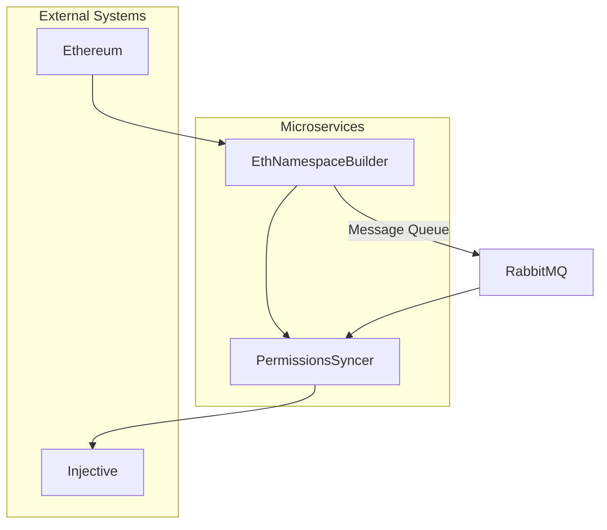
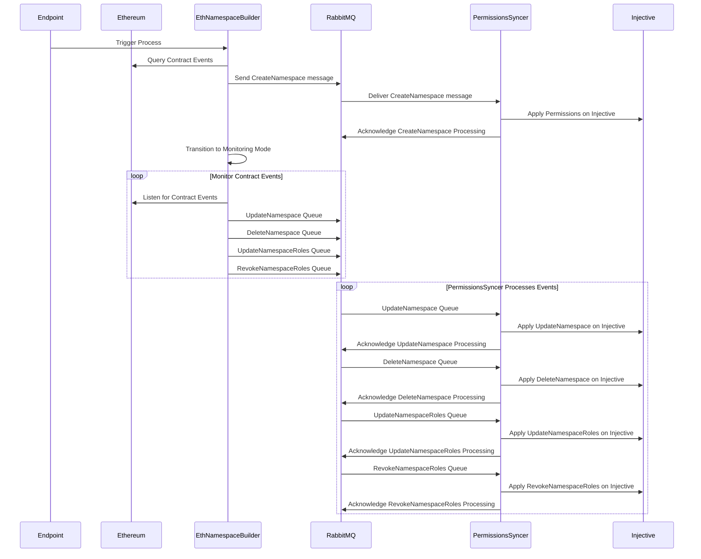

# Whitelist permissions mirror Microservice

## Overview

This microservice continuously monitors and updates a token’s permission structure on the Injective blockchain using the Injective [permissions module](https://docs.injective.network/develop/modules/Injective/permissions/). It observes an Ethereum smart contract whitelist and mirrors changes to Injective by converting Ethereum addresses into Injective addresses and applying the appropriate permissions.

The microservice uses RabbitMQ as a message broker for communication between its components, providing flexibility for scaling and language interoperability. Additionally, each service exposes HTTP endpoints for isolated tasks.

## Architecture

The microservice consists of two key services:

1. **EthNamespaceBuilder**:
   - Fetches whitelist data from an Ethereum smart contract.
   - Converts Ethereum addresses into Injective addresses.
   - Classifies the data into roles and namespaces.
   - Sends the classified data to **PermissionsSyncer** via RabbitMQ.

2. **PermissionsSyncer**:
   - Receives classified data from **EthNamespaceBuilder**.
   - Applies the appropriate permissions (minting, burning, etc.) on the Injective blockchain based on the data received.

### Communication

Both services communicate via **RabbitMQ** for asynchronous processing and decoupling:
- **Queue**: Messages containing whitelist and role data are sent from **EthNamespaceBuilder** to **PermissionsSyncer** through a RabbitMQ queue.
- **Acknowledgments**: Tasks are acknowledged upon completion to ensure reliability and prevent duplication.

## Flexibility & Scalability

RabbitMQ supports many languages, such as Go, Python, JavaScript, and more. This microservice architecture enables future developers to build additional services in any language supported by RabbitMQ, providing flexibility to extend the functionality without being limited to specific languages or frameworks.

## HTTP Endpoints

Each service also exposes RESTful HTTP endpoints for triggering specific tasks independently.

- **EthNamespaceBuilder Endpoints**:
  - `/start`: Triggers the full process of fetching the Ethereum whitelist, converting addresses, and sending the namespace to **PermissionsSyncer**.
  - `/convert-addresses`: Converts Ethereum addresses to Injective addresses for a specific set of input addresses.

- **PermissionsSyncer Endpoints**:
  - `/apply-permissions`: Applies permissions to Injective based on the data received from **EthNamespaceBuilder** or manual inputs.

## How to Run

The services are containerized using Docker and can be orchestrated using Docker Compose. To start the microservices, follow these steps:

1. **Ensure Docker and Docker Compose are installed**.
   
2. **Start the services**:
   - Run the following command to spin up both **EthNamespaceBuilder** and **PermissionsSyncer**:
     ```bash
     docker-compose up --build
     ```

3. **Access the HTTP endpoints**:
   - **EthNamespaceBuilder** will be available on port `8000`.
   - **PermissionsSyncer** will be available on port `8001`.

## Testing

This project includes Hurl files for testing the HTTP endpoints of both services. The Hurl files are located in the `testing` directory and contain predefined test cases to ensure the services' endpoints behave as expected.

### To Run the Tests:

1. Ensure the services are running (`docker-compose up`).
2. Navigate to the `testing` folder and run the appropriate `.hurl` files:
   ```bash
   hurl run ./testing/EthNamespaceBuilder.hurl
   hurl run ./testing/PermissionsSyncer.hurl
   ```
   These test cases check the available endpoints to verify functionality.

## Flow Overview

### High-Level System Architecture

The diagram below illustrates a high-level overview of the microservices architecture. **EthNamespaceBuilder** fetches data from Ethereum, processes it, and communicates with **PermissionsSyncer** through a RabbitMQ message queue. **PermissionsSyncer** applies the relevant permissions on the Injective blockchain.



### Detailed Process Flow

The sequence diagram below provides a more detailed look at how each component interacts, from the initial trigger to applying permissions on Injective. The **EthNamespaceBuilder** transitions into a monitoring mode, continuously querying Ethereum for updates and sending them to **PermissionsSyncer** via RabbitMQ.


